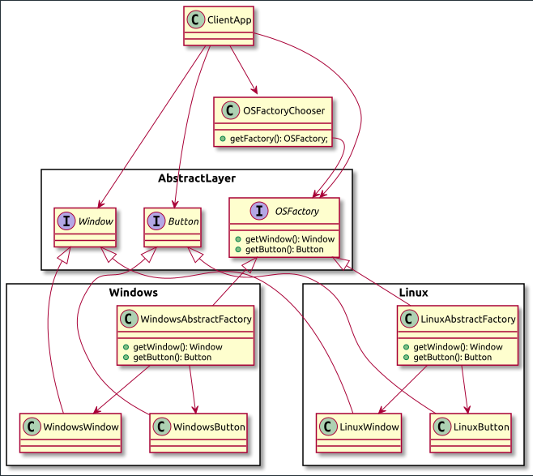

В данном проекте описан паттерн Абстрактная фабрика.

Суть паттерна - создание семейства объектов, не привязываясь к конкретным классам создаваемых объектов

Пример:

Пусть у нас есть библиотека, описывающая графические примитивы `Window`, `Button`, `Scrollbar`.
Библиотека кроссплатформенная и поддерживает работу под windows и linux.

Пусть у нас есть клиентский код, использующий данную библиотеку.
Вместо того, чтобы инстанциировать конкретную реализацию `Window` в клиенстком коде, в зависимости от операционной системы,
мы можем переложить эту ответственность на специальные классы типа `WindowsAbstractFactory` и `LinuxAbstractFactory`,
которые умеют инстанциировать конкретные объекты под заданную операционную систему.

Так же мы можем создать класс `OSFactoryChooser`, который, в зависимости от переданной операционной системы вернет ту или иную фабрику.

Данный подход позволяет не зависеть в клиентском коде от того, на какой операционной системе запускается приложение 

Схему uml можно посмотреть в файле [файле](./doc/abstract-factory.puml)

