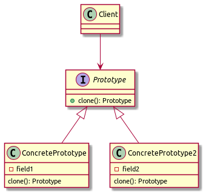

В данном проекте описан паттерн прототип.

Данный паттерн используется, когда необходимо создать копию объекта 
с определенным сложным состоянием. За клонирование объекта отвечает сам объект
через реализацию общего метода интерфейса clone

